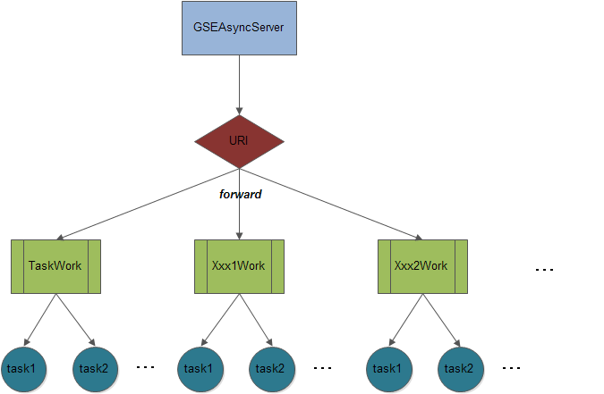

## GSEAsyncServer

Golang Simple and Efficient Asynchronous http Server

## Principle

The architecture of GSEAsyncServer is illustrated as follows:



## Build

```
export GOPATH=/data/go
go get github.com/golang/glog
go get github.com/go-sql-driver/mysql
go get gopkg.in/yaml.v2
go get github.com/sirupsen/logrus
mkdir /data/duyanghao/
cd /data/duyanghao/
git clone https://github.com/duyanghao/GSEAsyncServer.git
cd /data/duyanghao/GSEAsyncServer/
ln -s $PWD/handle $GOPATH/src/handle
ln -s $PWD/Configuration $GOPATH/src/Configuration
export GOPATH=$PWD:$GOPATH
go build
```

## Usage

```
bash start.sh
```

## Test

Execute concurrent test as below:

```bash
bash concurrent_test.sh 30
```

Test Request Log:

```
try 1 ...
Message successfully received!
try 2 ...
Message successfully received!
try 3 ...
Message successfully received!
try 4 ...
Message successfully received!
try 5 ...
Message successfully received!
try 6 ...
Message successfully received!
try 7 ...
Message successfully received!
try 8 ...
Message successfully received!
try 9 ...
Message successfully received!
try 10 ...
Message successfully received!
try 11 ...
Message successfully received!
try 12 ...
Message: {Msg:test message 12} handle failed,error: Async task {MessageTask:{Msg:test message 12} ErrChan:0xc42014e120} timeout.
try 13 ...
Message successfully received!
try 14 ...
Message successfully received!
try 15 ...
Message successfully received!
try 16 ...
Message successfully received!
try 17 ...
Message successfully received!
try 18 ...
Message successfully received!
try 19 ...
Message successfully received!
try 20 ...
Message successfully received!
try 21 ...
Message successfully received!
try 22 ...
Message successfully received!
try 23 ...
Message: {Msg:test message 23} handle failed,error: Async task {MessageTask:{Msg:test message 23} ErrChan:0xc42014f020} timeout.
try 24 ...
Message successfully received!
try 25 ...
Message successfully received!
try 26 ...
Message successfully received!
try 27 ...
Message successfully received!
try 28 ...
Message successfully received!
try 29 ...
Message successfully received!
try 30 ...
Message successfully received!
```

GSEAsyncServer.log:

```
{"level":"info","message":"Handle task: {MessageTask:{Msg:test message 1} ErrChan:0xc4200e0180}","msg":"","time":"2017-12-22T15:31:59+08:00"}
{"level":"info","message":"Message: test message 1 received ...","msg":"","time":"2017-12-22T15:31:59+08:00"}
{"level":"info","message":"Handle task: {MessageTask:{Msg:test message 2} ErrChan:0xc4200a5320}","msg":"","time":"2017-12-22T15:31:59+08:00"}
{"level":"info","message":"Message: test message 2 received ...","msg":"","time":"2017-12-22T15:31:59+08:00"}
{"level":"info","message":"Handle task: {MessageTask:{Msg:test message 3} ErrChan:0xc4200a5620}","msg":"","time":"2017-12-22T15:31:59+08:00"}
{"level":"info","message":"Message: test message 3 received ...","msg":"","time":"2017-12-22T15:31:59+08:00"}
{"level":"info","message":"Handle task: {MessageTask:{Msg:test message 4} ErrChan:0xc4200a5920}","msg":"","time":"2017-12-22T15:31:59+08:00"}
{"level":"info","message":"Message: test message 4 received ...","msg":"","time":"2017-12-22T15:31:59+08:00"}
{"level":"info","message":"Handle task: {MessageTask:{Msg:test message 5} ErrChan:0xc4200a5c20}","msg":"","time":"2017-12-22T15:32:00+08:00"}
{"level":"info","message":"Message: test message 5 received ...","msg":"","time":"2017-12-22T15:32:00+08:00"}
{"level":"info","message":"Handle task: {MessageTask:{Msg:test message 6} ErrChan:0xc4200a5f20}","msg":"","time":"2017-12-22T15:32:00+08:00"}
{"level":"info","message":"Message: test message 6 received ...","msg":"","time":"2017-12-22T15:32:00+08:00"}
{"level":"info","message":"Handle task: {MessageTask:{Msg:test message 7} ErrChan:0xc4201aa240}","msg":"","time":"2017-12-22T15:32:00+08:00"}
{"level":"info","message":"Message: test message 7 received ...","msg":"","time":"2017-12-22T15:32:00+08:00"}
{"level":"info","message":"Handle task: {MessageTask:{Msg:test message 8} ErrChan:0xc4201aa540}","msg":"","time":"2017-12-22T15:32:00+08:00"}
{"level":"info","message":"Message: test message 8 received ...","msg":"","time":"2017-12-22T15:32:00+08:00"}
{"level":"info","message":"Handle task: {MessageTask:{Msg:test message 9} ErrChan:0xc4201aa840}","msg":"","time":"2017-12-22T15:32:00+08:00"}
{"level":"info","message":"Message: test message 9 received ...","msg":"","time":"2017-12-22T15:32:00+08:00"}
{"level":"info","message":"Handle task: {MessageTask:{Msg:test message 10} ErrChan:0xc4201aab40}","msg":"","time":"2017-12-22T15:32:00+08:00"}
{"level":"info","message":"Message: test message 10 received ...","msg":"","time":"2017-12-22T15:32:00+08:00"}
E1222 15:32:30.473391   14118 main.go:73] Message: {Msg:test message 12} handle failed,error: Async task {MessageTask:{Msg:test message 12} ErrChan:0xc42014e120} timeout.
{"level":"info","message":"Successfully async task: {MessageTask:{Msg:test message 1} ErrChan:0xc4200e0180}","msg":"","time":"2017-12-22T15:32:59+08:00"}
I1222 15:32:59.778478   14118 task.go:122] 
=======================分割线======================
{"level":"info","message":"Handle task: {MessageTask:{Msg:test message 11} ErrChan:0xc4201aae40}","msg":"","time":"2017-12-22T15:32:59+08:00"}
{"level":"info","message":"Message: test message 11 received ...","msg":"","time":"2017-12-22T15:32:59+08:00"}
{"level":"info","message":"Successfully async task: {MessageTask:{Msg:test message 2} ErrChan:0xc4200a5320}","msg":"","time":"2017-12-22T15:32:59+08:00"}
I1222 15:32:59.843350   14118 task.go:122] 
=======================分割线======================
{"level":"info","message":"Handle task: {MessageTask:{Msg:test message 13} ErrChan:0xc42014e2a0}","msg":"","time":"2017-12-22T15:32:59+08:00"}
{"level":"info","message":"Message: test message 13 received ...","msg":"","time":"2017-12-22T15:32:59+08:00"}
{"level":"info","message":"Successfully async task: {MessageTask:{Msg:test message 3} ErrChan:0xc4200a5620}","msg":"","time":"2017-12-22T15:32:59+08:00"}
I1222 15:32:59.903584   14118 task.go:122] 
=======================分割线======================
{"level":"info","message":"Handle task: {MessageTask:{Msg:test message 14} ErrChan:0xc4201ab140}","msg":"","time":"2017-12-22T15:32:59+08:00"}
{"level":"info","message":"Message: test message 14 received ...","msg":"","time":"2017-12-22T15:32:59+08:00"}
{"level":"info","message":"Successfully async task: {MessageTask:{Msg:test message 4} ErrChan:0xc4200a5920}","msg":"","time":"2017-12-22T15:32:59+08:00"}
I1222 15:32:59.968603   14118 task.go:122] 
=======================分割线======================
{"level":"info","message":"Handle task: {MessageTask:{Msg:test message 15} ErrChan:0xc4201ab500}","msg":"","time":"2017-12-22T15:32:59+08:00"}
{"level":"info","message":"Message: test message 15 received ...","msg":"","time":"2017-12-22T15:32:59+08:00"}
{"level":"info","message":"Successfully async task: {MessageTask:{Msg:test message 5} ErrChan:0xc4200a5c20}","msg":"","time":"2017-12-22T15:33:00+08:00"}
I1222 15:33:00.030247   14118 task.go:122] 
=======================分割线======================
{"level":"info","message":"Handle task: {MessageTask:{Msg:test message 16} ErrChan:0xc4200e0780}","msg":"","time":"2017-12-22T15:33:00+08:00"}
{"level":"info","message":"Message: test message 16 received ...","msg":"","time":"2017-12-22T15:33:00+08:00"}
{"level":"info","message":"Successfully async task: {MessageTask:{Msg:test message 6} ErrChan:0xc4200a5f20}","msg":"","time":"2017-12-22T15:33:00+08:00"}
I1222 15:33:00.095144   14118 task.go:122] 
=======================分割线======================
{"level":"info","message":"Handle task: {MessageTask:{Msg:test message 17} ErrChan:0xc4201ab8c0}","msg":"","time":"2017-12-22T15:33:00+08:00"}
{"level":"info","message":"Message: test message 17 received ...","msg":"","time":"2017-12-22T15:33:00+08:00"}
{"level":"info","message":"Successfully async task: {MessageTask:{Msg:test message 7} ErrChan:0xc4201aa240}","msg":"","time":"2017-12-22T15:33:00+08:00"}
I1222 15:33:00.159390   14118 task.go:122] 
=======================分割线======================
{"level":"info","message":"Handle task: {MessageTask:{Msg:test message 18} ErrChan:0xc42014e720}","msg":"","time":"2017-12-22T15:33:00+08:00"}
{"level":"info","message":"Message: test message 18 received ...","msg":"","time":"2017-12-22T15:33:00+08:00"}
{"level":"info","message":"Successfully async task: {MessageTask:{Msg:test message 8} ErrChan:0xc4201aa540}","msg":"","time":"2017-12-22T15:33:00+08:00"}
I1222 15:33:00.222106   14118 task.go:122] 
=======================分割线======================
{"level":"info","message":"Handle task: {MessageTask:{Msg:test message 19} ErrChan:0xc4200e0b40}","msg":"","time":"2017-12-22T15:33:00+08:00"}
{"level":"info","message":"Message: test message 19 received ...","msg":"","time":"2017-12-22T15:33:00+08:00"}
{"level":"info","message":"Successfully async task: {MessageTask:{Msg:test message 9} ErrChan:0xc4201aa840}","msg":"","time":"2017-12-22T15:33:00+08:00"}
I1222 15:33:00.282448   14118 task.go:122] 
=======================分割线======================
{"level":"info","message":"Handle task: {MessageTask:{Msg:test message 20} ErrChan:0xc42014eae0}","msg":"","time":"2017-12-22T15:33:00+08:00"}
{"level":"info","message":"Message: test message 20 received ...","msg":"","time":"2017-12-22T15:33:00+08:00"}
{"level":"info","message":"Successfully async task: {MessageTask:{Msg:test message 10} ErrChan:0xc4201aab40}","msg":"","time":"2017-12-22T15:33:00+08:00"}
I1222 15:33:00.347428   14118 task.go:122] 
=======================分割线======================
{"level":"info","message":"Handle task: {MessageTask:{Msg:test message 21} ErrChan:0xc42014eea0}","msg":"","time":"2017-12-22T15:33:00+08:00"}
{"level":"info","message":"Message: test message 21 received ...","msg":"","time":"2017-12-22T15:33:00+08:00"}
E1222 15:33:30.415168   14118 main.go:73] Message: {Msg:test message 23} handle failed,error: Async task {MessageTask:{Msg:test message 23} ErrChan:0xc42014f020} timeout.
{"level":"info","message":"Successfully async task: {MessageTask:{Msg:test message 11} ErrChan:0xc4201aae40}","msg":"","time":"2017-12-22T15:33:59+08:00"}
I1222 15:33:59.778809   14118 task.go:122] 
=======================分割线======================
{"level":"info","message":"Handle task: {MessageTask:{Msg:test message 22} ErrChan:0xc4201abce0}","msg":"","time":"2017-12-22T15:33:59+08:00"}
{"level":"info","message":"Message: test message 22 received ...","msg":"","time":"2017-12-22T15:33:59+08:00"}
{"level":"info","message":"Successfully async task: {MessageTask:{Msg:test message 13} ErrChan:0xc42014e2a0}","msg":"","time":"2017-12-22T15:33:59+08:00"}
I1222 15:33:59.843520   14118 task.go:122] 
=======================分割线======================
{"level":"info","message":"Handle task: {MessageTask:{Msg:test message 24} ErrChan:0xc4200e0cc0}","msg":"","time":"2017-12-22T15:33:59+08:00"}
{"level":"info","message":"Message: test message 24 received ...","msg":"","time":"2017-12-22T15:33:59+08:00"}
{"level":"info","message":"Successfully async task: {MessageTask:{Msg:test message 14} ErrChan:0xc4201ab140}","msg":"","time":"2017-12-22T15:33:59+08:00"}
I1222 15:33:59.903739   14118 task.go:122] 
=======================分割线======================
{"level":"info","message":"Handle task: {MessageTask:{Msg:test message 25} ErrChan:0xc4200e0fc0}","msg":"","time":"2017-12-22T15:33:59+08:00"}
{"level":"info","message":"Message: test message 25 received ...","msg":"","time":"2017-12-22T15:33:59+08:00"}
{"level":"info","message":"Successfully async task: {MessageTask:{Msg:test message 15} ErrChan:0xc4201ab500}","msg":"","time":"2017-12-22T15:33:59+08:00"}
I1222 15:33:59.968751   14118 task.go:122] 
=======================分割线======================
{"level":"info","message":"Handle task: {MessageTask:{Msg:test message 26} ErrChan:0xc4200e1560}","msg":"","time":"2017-12-22T15:33:59+08:00"}
{"level":"info","message":"Message: test message 26 received ...","msg":"","time":"2017-12-22T15:33:59+08:00"}
{"level":"info","message":"Successfully async task: {MessageTask:{Msg:test message 16} ErrChan:0xc4200e0780}","msg":"","time":"2017-12-22T15:34:00+08:00"}
I1222 15:34:00.030411   14118 task.go:122] 
=======================分割线======================
{"level":"info","message":"Handle task: {MessageTask:{Msg:test message 27} ErrChan:0xc42014f680}","msg":"","time":"2017-12-22T15:34:00+08:00"}
{"level":"info","message":"Message: test message 27 received ...","msg":"","time":"2017-12-22T15:34:00+08:00"}
{"level":"info","message":"Successfully async task: {MessageTask:{Msg:test message 17} ErrChan:0xc4201ab8c0}","msg":"","time":"2017-12-22T15:34:00+08:00"}
I1222 15:34:00.095341   14118 task.go:122] 
=======================分割线======================
{"level":"info","message":"Handle task: {MessageTask:{Msg:test message 28} ErrChan:0xc4200e1980}","msg":"","time":"2017-12-22T15:34:00+08:00"}
{"level":"info","message":"Message: test message 28 received ...","msg":"","time":"2017-12-22T15:34:00+08:00"}
{"level":"info","message":"Successfully async task: {MessageTask:{Msg:test message 18} ErrChan:0xc42014e720}","msg":"","time":"2017-12-22T15:34:00+08:00"}
I1222 15:34:00.159541   14118 task.go:122] 
=======================分割线======================
{"level":"info","message":"Handle task: {MessageTask:{Msg:test message 29} ErrChan:0xc42014faa0}","msg":"","time":"2017-12-22T15:34:00+08:00"}
{"level":"info","message":"Message: test message 29 received ...","msg":"","time":"2017-12-22T15:34:00+08:00"}
{"level":"info","message":"Successfully async task: {MessageTask:{Msg:test message 19} ErrChan:0xc4200e0b40}","msg":"","time":"2017-12-22T15:34:00+08:00"}
I1222 15:34:00.222250   14118 task.go:122] 
=======================分割线======================
{"level":"info","message":"Handle task: {MessageTask:{Msg:test message 30} ErrChan:0xc420208120}","msg":"","time":"2017-12-22T15:34:00+08:00"}
{"level":"info","message":"Message: test message 30 received ...","msg":"","time":"2017-12-22T15:34:00+08:00"}
{"level":"info","message":"Successfully async task: {MessageTask:{Msg:test message 20} ErrChan:0xc42014eae0}","msg":"","time":"2017-12-22T15:34:00+08:00"}
I1222 15:34:00.282610   14118 task.go:122] 
=======================分割线======================
{"level":"info","message":"Successfully async task: {MessageTask:{Msg:test message 21} ErrChan:0xc42014eea0}","msg":"","time":"2017-12-22T15:34:00+08:00"}
I1222 15:34:00.347615   14118 task.go:122] 
=======================分割线======================
```

## Refs

* [Go by Example: Arrays](https://gobyexample.com/arrays)
* [sirupsen/logrus](https://github.com/sirupsen/logrus)
